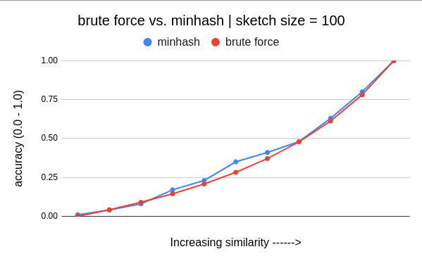
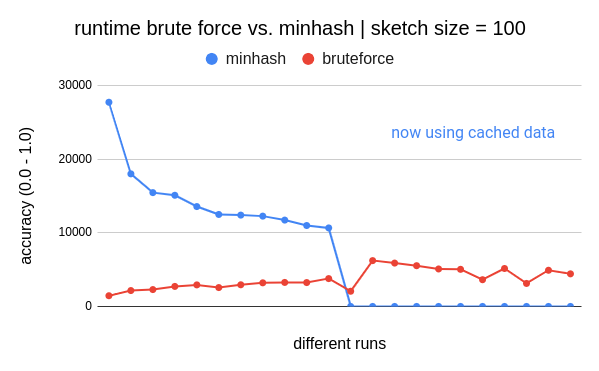

## Implement Jaccard Similarity using Minhash technique

### Problem statement
Given two documents, find the similarity between them. The problem does not involve extracting any semantic meaning of the documents but simply looking at whether they contain the same words.

### Solution Approach
In this project, I implemented Minhash algorithm to calclate Jaccard similarity for given documents. Also, compared it with brute force approach. All the explanation and results are provided [here](https://pallavi-garg.github.io/projects/documentsimilarity.html).

### General Observation
1. As we increase the sketch_size, the **accuracy** increases.
    
    
    
2. Higher the sketch size, more time is taken in preprocessing the sketches.
3. Once, all the sketches are made and cached, minhash is 99% faster as per my experimentation.

For more details checkout [this](https://pallavi-garg.github.io/projects/documentsimilarity.html)!
